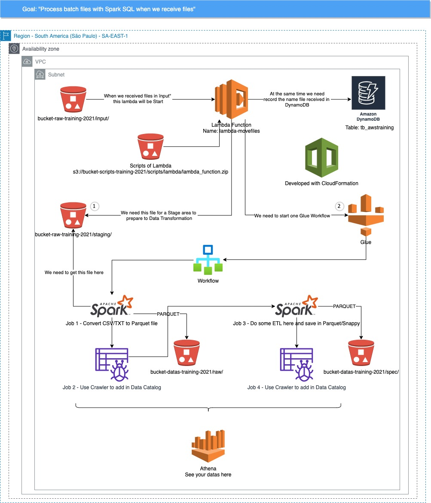

# AWSTraining
This repository are used to give class about AWS
 <b>by Marco Antonio Pereira</b>

To see the types of EC2 instances:
https://aws.amazon.com/ec2/instance-types

To see the price of each EC2 instances:
https://aws.amazon.com/ec2/pricing/on-demand

To calculate and get one estimate the price about some AWS service:
https://calculator.aws/#/

AWS SDK Reference Guide:
https://aws.amazon.com/sdk-for-python/

# CloudFormation
VPC Template: https://docs.aws.amazon.com/codebuild/latest/userguide/cloudformation-vpc-template.html

Security Group Template: https://docs.aws.amazon.com/AWSCloudFormation/latest/UserGuide/aws-properties-ec2-security-group.html

S3 Bucket Template: https://docs.aws.amazon.com/AWSCloudFormation/latest/UserGuide/aws-properties-s3-bucket.html

Lambda Template: https://docs.aws.amazon.com/AWSCloudFormation/latest/UserGuide/aws-resource-lambda-function.html

DynamoDB Template: https://docs.aws.amazon.com/AWSCloudFormation/latest/UserGuide/aws-resource-dynamodb-table.html

Glue Workflow Template: https://docs.aws.amazon.com/AWSCloudFormation/latest/UserGuide/aws-resource-glue-workflow.html

Glue Job Template: https://docs.aws.amazon.com/AWSCloudFormation/latest/UserGuide/aws-resource-glue-job.html

### Observation about my Lambda CloudFormation
Before to create [this lambda function link](https://github.com/MarcoAP/AWSTraining/blob/main/CloudFormation/Lambda/lambdaWithBucketNotification.yml) you need to create [this bucket for scripts link](https://github.com/MarcoAP/AWSTraining/blob/main/CloudFormation/S3/bucketArchiveAndBucketScripts.yml) firstly and then insert your scripts [like this link](https://github.com/MarcoAP/AWSTraining/tree/main/CloudFormation/Lambda/scripts/lambda) but all need be zipped.

# Index
| Aws Services - Scripts  | Link |
| ------------- |-------------:| 
| VPC / Subnet / Internet Gateway | [link](https://github.com/MarcoAP/AWSTraining/tree/main/CloudFormation/Network) |
| S3 Bucket | [link](https://github.com/MarcoAP/AWSTraining/tree/main/CloudFormation/S3) |
| EC2 | [link](https://github.com/MarcoAP/AWSTraining/tree/main/CloudFormation/EC2) |
| DynamoDB | [link](https://github.com/MarcoAP/AWSTraining/tree/main/CloudFormation/DynamoDB) |
| Lambda Function | [link](https://github.com/MarcoAP/AWSTraining/tree/main/CloudFormation/Lambda) |
| Glue Workflow | Construction |
| Glue Job | Construction |
| Glue Crawler | Construction |

# Use case

